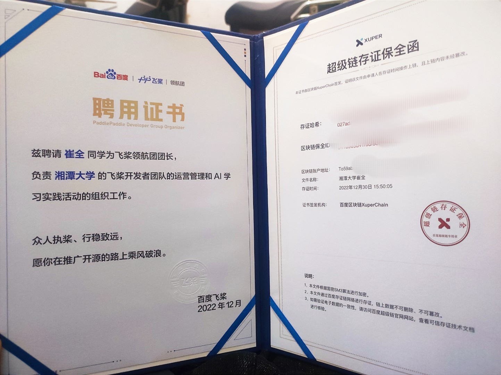

2023年即将接近尾声，在此写下20年人生中的第一次年度总结。（上）

<!-- truncate -->

自来上海以来，近期算是我最闲暇的时光，正好可以搭自己的博客，做自己想做的一些事情，顺便记录一下我的2023年。（多图警告！）

自从上大学以来已经有三年半载了。如果不算大四这年（实习，找工作，考研，保研），相当于我大学的主要生涯也确实是结束了。突然感觉时间过的好快，一下我就成学长了，我也快毕业了，我也20出头了。

因此在此做下我2023年度的总结，顺带设想一下2024的一年。

## 2023年度展示！：

### 2023.1 开始正式加入百度飞桨大家庭

收到来自飞桨的聘书

### 2023.3 准备智能车线上赛

其实对于今年的参赛安排，我个人是相当矛盾的。一方面是由于去年的国奖使我已经获得了保研资格，只是绩点太低，并不能确定我是保内还是保外。此时也算是我比较迷茫的时期。一方面绩点摆在这里，今年就算全部的科目满绩点也不能保证达到保外的要求，因此我大概率是保本校的。但是我自己又不太想留在本校，但是面对考研我没有做好足够的心理准备是毫无疑问的。

同时期父母施压，希望我边把本学期绩点搞好，边参加比赛，边准备考研的复习。显然是不太可能的。唯独最后者我不太上心，因为时间的问题

