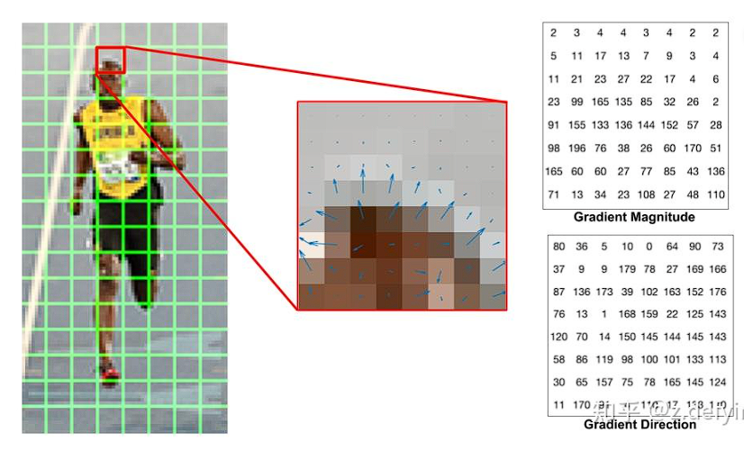
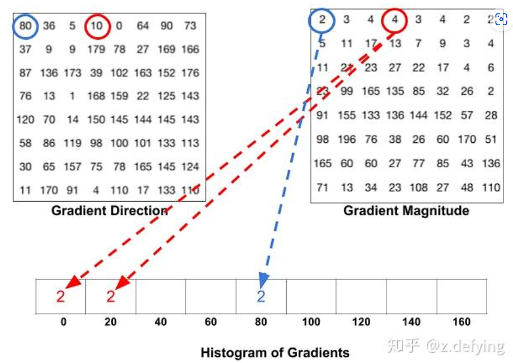
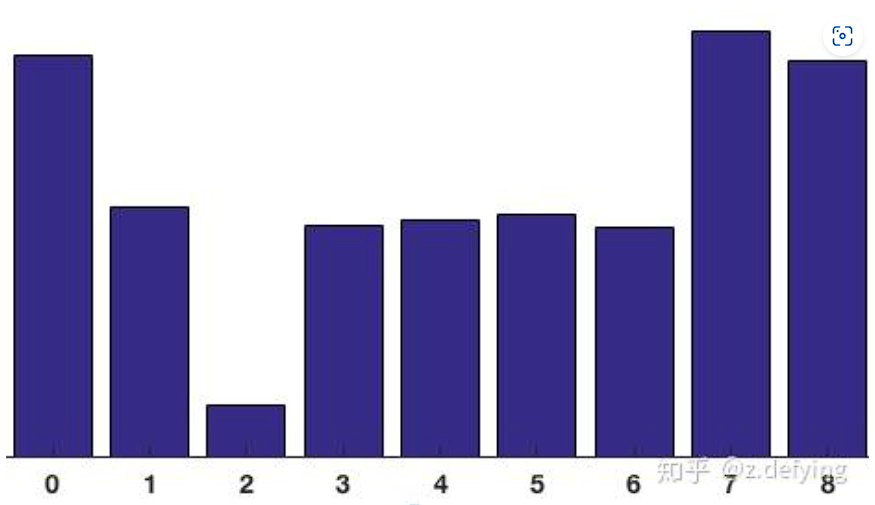
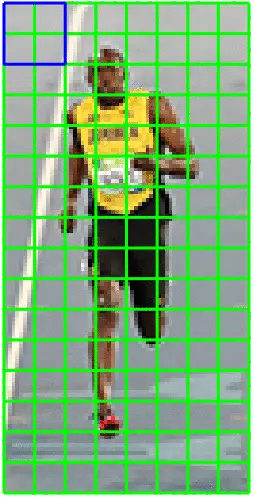
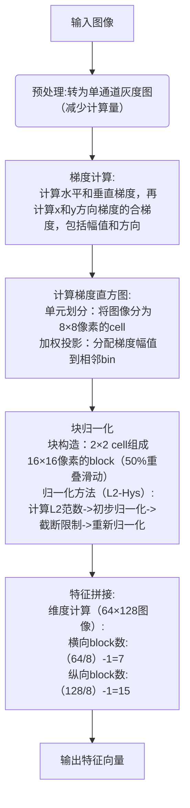
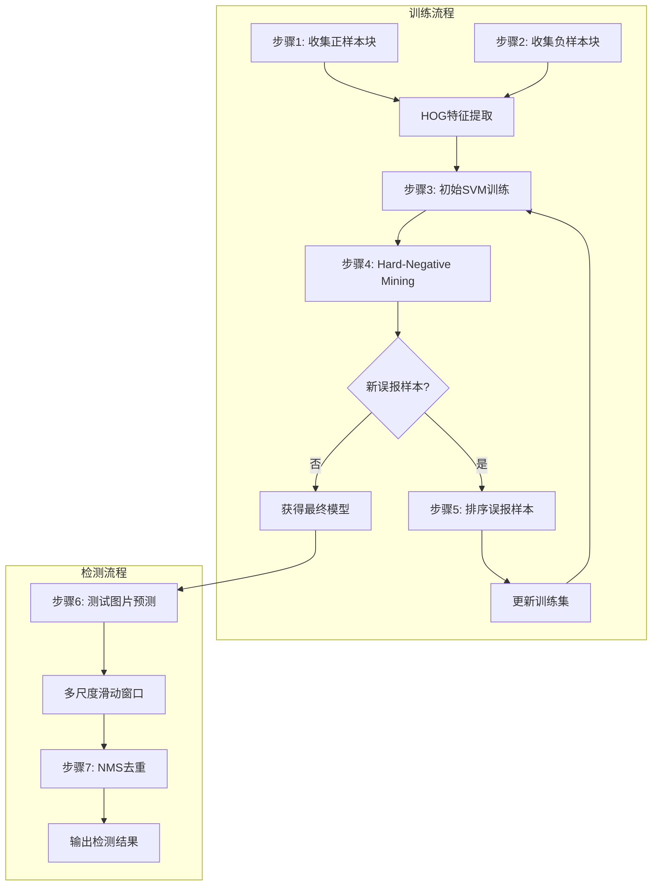
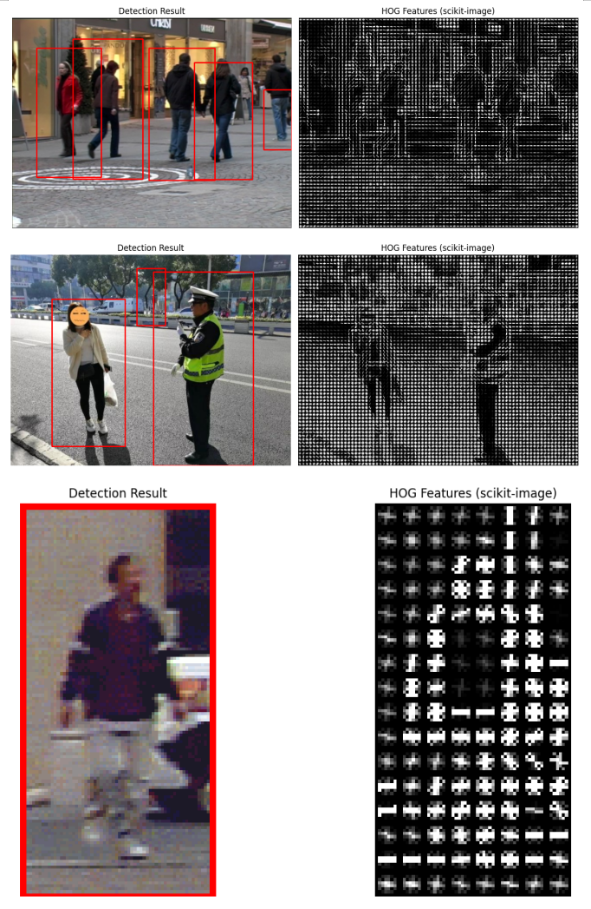
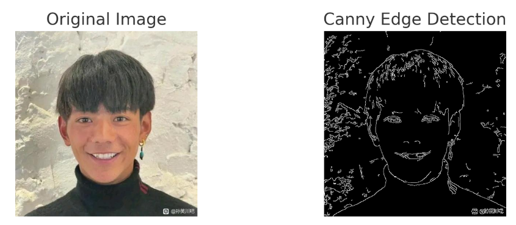
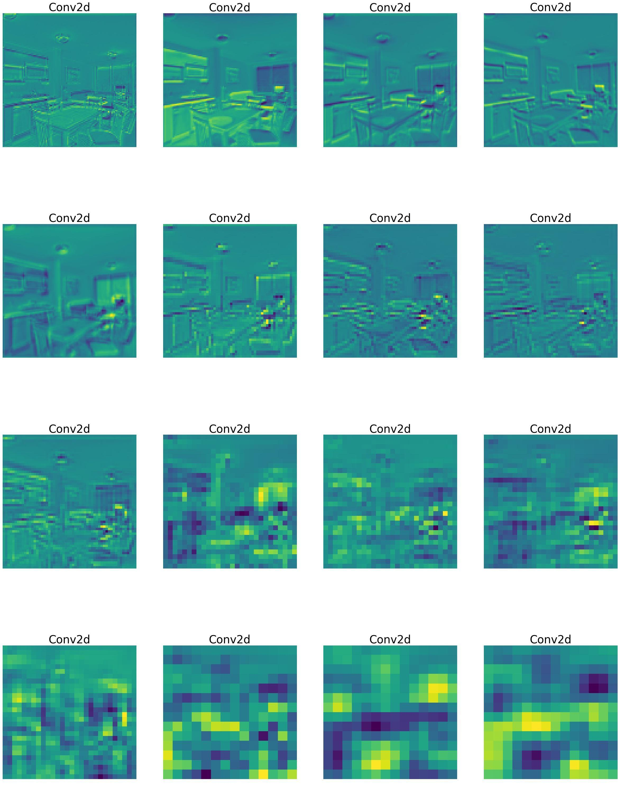

传统图像特征提取方法及其应用

计算机视觉课程报告

<!-- truncate -->
# 传统图像特征提取方法及其应用

## 一、特征提取方法原理

### SIFT（尺度不变特征变换）
&zwnj;**原理**&zwnj;：
1. &zwnj;**尺度空间极值检测**&zwnj;：通过高斯差分金字塔检测图像中的关键点
2. &zwnj;**关键点定位**&zwnj;：通过泰勒展开和Hessian矩阵消除不稳定特征点
3. &zwnj;**方向分配**&zwnj;：计算关键点邻域梯度方向直方图确定主方向
4. &zwnj;**描述子生成**&zwnj;：将16x16邻域划分为4x4子区域，每个子区域计算8方向梯度直方图，形成128维特征向量

$$
\text{梯度计算：} 
\begin{aligned}
m(x,y) &= \sqrt{(L(x+1,y)-L(x-1,y))^2 + (L(x,y+1)-L(x,y-1))^2} \\
\theta(x,y) &= \arctan\left(\frac{L(x,y+1)-L(x,y-1)}{L(x+1,y)-L(x-1,y)}\right)
\end{aligned}
$$


### LBP（局部二值模式）
&zwnj;**原理**&zwnj;：
1. &zwnj;**邻域比较**&zwnj;：对每个像素的3x3邻域进行阈值处理
2. &zwnj;**二进制编码**&zwnj;：将邻域像素与中心值比较，生成8位二进制数
3. &zwnj;**直方图统计**&zwnj;：统计图像中不同LBP模式的分布
4. &zwnj;**改进方法**&zwnj;：圆形邻域（扩展LBP）、均匀模式（Uniform LBP）
   
### HOG（方向梯度直方图）
#### 1. 基本思想
HOG（Histogram of Oriented Gradients）通过统计图像局部区域的&zwnj;**梯度方向分布**&zwnj;来表征物体特征。其核心假设是：
- &zwnj;**物体形状**&zwnj;可由边缘和梯度分布描述
- &zwnj;**局部梯度方向**&zwnj;对光照变化具有鲁棒性

#### 2. 数学基础
（这里不清楚是什么原因导致的数学公式反复渲染 会存在一次数学公式和渲染前的文字）
- &zwnj;**梯度计算**&zwnj;：  
$$
\begin{cases}
G_x = I(x+1, y) - I(x-1, y) \\[10pt]
G_y = I(x, y+1) - I(x, y-1)
\end{cases}
$$
- &zwnj;**幅值与方向**&zwnj;：  
$$
\text{梯度计算：} 
\begin{aligned}
m(x, y) &= \sqrt{(L(x+1, y) - L(x-1, y))^2 + (L(x, y+1) - L(x, y-1))^2} \\[10pt]
\theta(x, y) &= \arctan\left(\frac{L(x, y+1) - L(x, y-1)}{L(x+1, y) - L(x-1, y)}\right)
\end{aligned}
$$

#### 3. HOG流程
- &zwnj;**图像预处理**&zwnj;：

- 可以对图像进行裁剪，并缩放到固定尺寸。
灰度处理是可选操作，因为灰度图像和彩色图像都可以用于计算梯度图，对于彩色图像，先对三通道颜色值分别计算梯度，然后取梯度值最大的那个作为该像素的梯度。
然后进行伽马矫正，调节图像对比度，减少光照对图像的影响（包括光照不均和局部阴影），使过曝或者欠曝的图像恢复正常，更接近人眼看到的图像。
- &zwnj;**计算梯度直方图**&zwnj;:
-   图像划分为若干个8x8的小单元，称为cell，并计算每个cell的梯度直方图。
    一个8x8的小单元就包含了8x8x2 = 128个值，把这个8x8的小单元用长度为9的数组来表示，这个数组就是梯度直方图。这种表示使得特征更加紧凑，而且对单个像素值的变化不敏感，也就是能够抗噪声干扰。

- 下图为图片中的一个cell中的梯度

- 左图是 8×8 的cell中表示梯度的原始数字，注意角度的范围介于0到180度之间，而不是0到360度， 这被称为“无符号”梯度，因为两个完全相反的方向被认为是相同的。
现在我们来计算cell中像素的梯度直方图，先将角度范围分成9份，也就是9 bins，每20°为一个单元，也就是这些像素可以根据角度分为9组。将每一份中所有像素对应的梯度值进行累加，可以得到9个数值。直方图就是由这9个数值组成的数组，对应于角度0、20、40、60... 160。

- 将这 8x8 的cell中所有像素的梯度值加到各自角度对应的bin中，就形成了长度为9的直方图，可以用这9个数的梯度直方图来代替原来很大的三维矩阵，即代替了8x8x2个值

- &zwnj;**Block 归一化（L2-Hys）**&zwnj;
- 图像的梯度对整体光照非常敏感，比如通过将所有像素值除以2来使图像变暗，那么梯度幅值将减小一半，因此直方图中的值也将减小一半。 理想情况下，我们希望我们的特征描述符不会受到光照变化的影响，那么我们就需要将直方图“归一化”。
- 归一化步骤为：

$$
\begin{aligned}
& 1.\ \text{计算 L2 范数}： v = \sqrt{\sum_{i=1}^{n} f_i^2 + \varepsilon^2} \\  

& 2.\ \text{初步归一化}： f'_i = \frac{f_i}{v} \\  

& 3.\ \text{截断限制}： f''_i = \min\{f'_i, 0.2\} \\  

& 4.\ \text{重新归一化}： f'''_i = \frac{f''_i}{\sqrt{\sum_{i=1}^{n} (f''_i)^2}}  

\end{aligned}
$$


- HOG将8×8的一个区域作为一个cell，再以2×2个cell作为一组，称为block。由于每个cell有9个值，2×2个cell则有36个值，HOG是通过滑动窗口的方式来得到block的，如下图所示：



- block的梯度直方图进行归一化（注意不是cell），一个block有4个直方图，将这4个直方图拼接成长度为36的向量，然后对这个向量进行归一化。
因为使用的是滑动窗口，滑动步长为8个像素，所以每滑动一次，就在这个窗口上进行归一化计算得到长度为36的向量，并重复这个过程。

- &zwnj;**计算HOG特征向量**&zwnj;
- 每滑动一次，一个block就得到一个长度为36的特征向量，如上面这个图，将整幅图像划分成cell的个数为8x16，就是横向有8个cell，纵向有16个cell。每个block有2x2个cell的话，那么block的个数为：(16-1)x(8-1)=105。即有7个水平block和15个竖直block。
再将这105个block合并，就得到了整个图像的特征描述符，长度为 105×36=3780。

- &zwnj;**HOG算法流程**&zwnj;




## 二、应用场景

### 图像匹配（SIFT）
- 特征点匹配：通过计算特征向量间的欧氏距离寻找匹配点对
- 图像拼接：利用RANSAC算法消除误匹配，实现全景图拼接
- 实例：无人机航拍图像配准、医学图像对齐

### 目标检测（HOG）
- 滑动窗口检测：在不同尺度上提取HOG特征
- 典型应用：行人检测、车辆检测
- 优势：对几何和光学变化具有鲁棒性

### 纹理分类（LBP）
- 人脸识别：LBP特征+AdaBoost分类器
- 工业检测：产品表面缺陷检测
- 生物特征：指纹识别、虹膜识别

# HOG（方向梯度直方图）原理详解

## 一、核心思想
&zwnj;**通过统计图像局部区域的梯度方向分布来表征物体形状特征**&zwnj;，特别擅长捕捉&zwnj;**边缘和轮廓信息**&zwnj;，对光照变化和微小位移具有鲁棒性。


## 二、算法流程分解

### 1. 预处理与归一化
```python
# 典型输入参数
image = cv2.resize(img, (64,128))  # 标准化图像尺寸
gamma = 1.0  # Gamma校正参数
```
## 三、HOG+SVM行人检测实例
#### 主要思想：
- 在一幅图像中，局部目标的表象和形状能够利用梯度或边缘的方向密度分布来进行描述。其本质是梯度的统计信息，而梯度主要存在于边缘所在的地方，HOG通过计算和统计局部区域的梯度方向直方图来构成特征，结合SVM分类器，应用于图像识别中。
- 由于HOG是在图像的局部方格单元上进行操作的，所以它对图像的几何和光学形变都能保持很好的不变性，这两种形变只会出现在更大的空间领域上。其次，在粗的空域抽样、精细的方向抽样以及较强的局部光学归一化等条件下，只要行人大体上能够保持直立的姿势，可以容许行人有一些细微的肢体动作，这些细微的动作可以被忽略而不影响检测效果。因此HOG特征特别适合于做图像中的人体检测。



### 1. 数据准备
```python
# 加载INRIA行人数据集（示例）
pos_samples = load_pos_samples()  # 包含行人的图像
neg_samples = load_neg_samples()  # 不包含行人的图像
test_samples = load_test_samples()  #测试图像
pos_samples, neg_samples, test_samples = load_data_set()
```
### 2. 训练与测试流程
```python
samples, labels = load_train_samples(pos, neg)  #载入训练图像
train = extract_hog(samples，winSize,blockSize,
                    blockStride,cellSize,nbins)    #提取HOG特征
svm_detector = train_svm(train, labels)  #训练SVM
test_hog_detect(test, svm_detector)  #测试
```

<!-- 图文标题 -->
##### 测试实例: 

## HOG方法局限
#### - 特征表达能力局限
###### 旋转敏感性‌
HOG特征本身不具备旋转不变性，需通过扩充不同旋转角度的训练样本来实现近似旋转鲁棒性‌26。当目标姿态变化超过训练样本覆盖范围时，检测准确率显著下降，尤其对肢体姿态大幅变化的目标（如舞蹈动作）适应性差‌
###### ‌尺度适应性差‌
HOG特征缺乏内在的尺度不变性机制，需通过构建图像金字塔实现多尺度检测，导致计算复杂度呈指数级增长。对于小尺度目标（如远距离行人），特征分辨率不足易导致漏检‌

#### - 二、算法性能瓶颈
###### ‌实时性不足‌
滑动窗口检测机制需遍历所有可能位置和尺度，即使采用多线程优化也难以满足实时检测需求
###### 计算复杂度高‌
HOG特征维度通常高达3780维（64×128像素块），结合SVM分类器时，单次检测计算量达10^6次浮点运算，FPGA硬件加速也难以突破功耗限制‌

#### - 三、场景适应性局限
###### ‌遮挡处理缺陷‌
HOG特征无法有效描述局部遮挡情况，当目标被遮挡超过30%时，检测准确率下降超50%。DPM方法虽引入可变形部件模型改进，但计算复杂度进一步增加‌
###### ‌抗干扰能力弱‌
梯度特征对光照突变、噪声敏感，需依赖高斯平滑预处理。在低光照或高噪声环境下（如雾天监控），误检率显著上升


## Q1：传统方法与深度学习方法在特征提取上的本质区别是什么?
### 什么是特征？
传统手工特征（底层特征、中间特征）、深度特征：

**底层特征**： 主要指基于图像自身，通过简单操作就能得出的特征。如颜色、纹理、形状、梯度等属于底层特征，它们也是中间特征操作的基础特征。图像视频领域广为熟知的底层特征有：RGB、LAB、HSV、HOG、LBP、SIFT、SURF、SILTP（LBP改进）。特点：相对简单，无需学习与训练，仅需简单计算与统计。

**中层特征**： 在底层特征基础上进行多特征融合处理获得的特征，主要是颜色和纹理的多样性融合。例如：LOMO（HSV+SILTP）。也只特征提取方式进行改进与创新的一类特征，通常融入较为复杂的数据理论处理过程。特点：比较复杂，主要体现在提取策略与融合过程。

**深度特征**： 通常设计神经网络模型来挖掘图像更深、更为抽象的特征。特点：无需手工参与，受光照、姿态等影响较小，但特征表达方式取法明确知道。

来自：储慧芳_《基于深度特征与传统特征融合的行人再识别研究》
### 什么是特征提取？
[特征提取是从一个初始测量的资料集合中开始做，然后建构出富含资讯性而且不冗余的导出值，称为特征值（feature）。它可以帮助接续的学习过程和归纳的步骤，在某些情况下可以让人更容易对资料做出较好的诠释。特征提取是一个降低维度的步骤，初始的资料集合被降到更容易管理的族群（特征）以便于学习，同时保持描述原始资料集的精准性与完整性。](https://zh.wikipedia.org/zh-hans/%E7%89%B9%E5%BE%B5%E6%8F%90%E5%8F%96)
特征提取是从原始数据中提取出有意义的信息（特征），以便机器学习模型能够更好地理解和处理数据。例如，在图像处理中，特征可以是边缘、纹理、颜色等；在文本处理中，特征可以是词频、句子长度等。详情参考下图：



### 概念解释
hand-crafted： 传统手工方法就是人工设计的一步步能够说出理由来的方法
特征提取是CV领域核心问题之一，特征提取从思路上有两大类：一类是手动设计（hand-crafted）的方式，一类是深度学习的方式，这两种方式都是在某些生物神经理论的基础下进行的， 不同之处是hand-crafted的方式设计的是特征本身，而深度学习的方式设计的是特征提取的框架结构。换种方式来说，就好比是hand-crafted特征是模仿我们所知的人类视觉的流程得到特征，而深度学习的方式重点是学习这个流程本身。

#### 传统方法VS深度学习

1. **Hand-crafted特征**： Hand-crafted特征是基于人类视觉系统设计的特征，如SIFT、SURF和HOG等，主要用于提取图像中具有区分能力的低层次特征（如边缘、角点、纹理和形状）。这些特征的设计依赖于人工选择和领域知识，因此其提取过程较为复杂且依赖于特定数据集。随着数据源的变化（如从RGB图像切换到Kinect深度图像），这些特征的效果可能会下降。此外，手工设计的特征通常不适应大规模数据处理，且处理速度较慢。总的来说，手工特征的可解释性较强，容易理解，但泛化能力较弱，无法轻松适应新的任务或数据分布变化。

2. **深度学习方法**： 深度学习通过神经网络自动学习图像或视频的特征，而不需要人工设计特征。网络通过层次化结构自动从低层次到高层次逐步提取特征，能够捕捉更加复杂的模式和抽象概念。与传统方法不同，深度学习方法对大量数据依赖较大，数据量越大，效果越好。这种方法的计算复杂度较高，通常需要较为强大的硬件支持。尽管深度学习的特征通常无法直观解释，像是“黑箱”，但其泛化能力强，能够适应各种任务和数据源的变化。参考下图深度学习模型训练中的特征图变化：


## Q2：传统方法在特定场景(如低光照低分辨率)中的优势与局限性
### 优势
1. 较低的计算要求：传统方法（如SIFT、SURF、HOG等）通常计算复杂度较低，因此能够在硬件资源受限的环境中运行，适用于实时处理需求。即便在低光照或低分辨率的情况下，处理速度仍能保持较高。

2. 较强的可解释性：传统特征通常具有明确的物理含义（如边缘、角点、纹理等），因此在低光照或低分辨率的图像中，特征的选择和行为较容易理解，便于调试和优化。

3. 不依赖大数据：与深度学习方法不同，传统方法不需要大量的数据来训练。即使是在数据量较小或缺乏标注的场景中，也能较好地提取有区分力的特征，特别是在一些简单或已知场景下（如固定环境的低光照场景）。
### 局限
1. 对低光照和低分辨率的敏感性：传统方法通常依赖于明显的图像特征（如边缘、角点等），在低光照或低分辨率的环境下，这些特征可能会变得不明显或丢失，导致特征提取困难，从而影响性能。

2. 缺乏鲁棒性：传统特征通常对噪声和光照变化较为敏感。在低光照条件下，噪声的影响更加显著，可能使得提取的特征不稳定，导致匹配和识别错误。

3. 局限于特定场景：传统方法在某些特定场景中表现良好（如较为静态的环境和背景），但在动态变化、复杂背景或遮挡严重的情况下，它们的表现较差，难以适应变化的环境。

4. 特征设计依赖人工经验：传统方法的特征设计依赖领域专家的经验，对于低光照或低分辨率图像，可能需要重新设计特征，这使得方法的适应性较差，缺乏通用性。

## 总结
| 对比项               | 传统方法                                   | 深度学习方法                               |
|----------------------|------------------------------------------|------------------------------------------|
| **特征提取方式**      | 依赖人工设计和选择特征                     | 通过神经网络自动学习特征                   |
| **特征表示**          | 低层次特征（如边缘、角点等）               | 多层次特征（从低层次到高层次逐步抽象）       |
| **数据依赖性**        | 对数据依赖较小，适合小数据集               | 依赖大量数据，数据越多效果越好               |
| **计算复杂度**        | 计算简单，适合实时应用                     | 计算复杂，需要高性能硬件                   |
| **泛化能力**          | 泛化能力较弱，难以适应新任务               | 泛化能力强，能适应不同任务和数据分布变化     |
| **可解释性**          | 特征可解释性强，易于理解和分析             | 特征可解释性较弱，通常被视为“黑箱”       |
### 结论
传统计算机视觉方法在低光照、低分辨率场景下仍有一定的计算效率优势，但在适应性、鲁棒性、泛化能力方面不如深度学习方法。传统方法和深度学习方法应当是相辅相成的关系。经典的CV方法可以让我们更加深刻地理解任务本身，因为在经典的CV方法中，每一个参数都具有物理意义；当我们掌握了经典CV方法之后，再去学习深度学习方法，对于问题的理解才会更加深刻。未来趋势是结合传统方法与深度学习，取长补短。例如：

自适应边缘检测 + CNN 纹理特征（提升低光照适应能力）
ORB/SIFT 关键点 + 深度学习特征匹配（提升低分辨率检测能力）