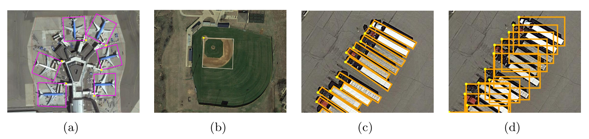
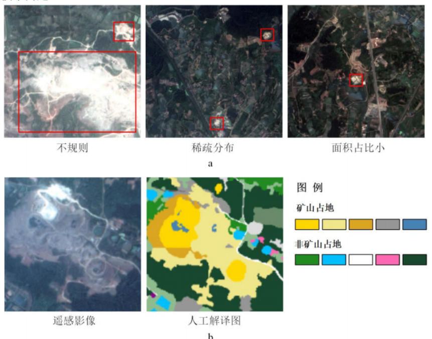

简要介绍一下自己的研究方向

<!-- truncate -->

# A intro of Compute Vision(CV) tasks in remote sensing(RS). 

Mainstream tasks of CV : Classification, Detection, Segmentation, Tracking .etc
Application：人脸识别，智能驾驶，车辆监控。

Mainstream tasks of CV in RS:

1. Image Classification: 判别整张遥感图像属于哪一类，比如：城市、农田、森林、水体等

2. Scene Classification: 对遥感影像的某个 patch（区域）进行场景识别，比如机场、港口、居民区

3. **Object Detection**: 检测遥感图像中的目标物体，例如飞机、舰船、车辆、建筑等

4. **Semantic Segmentation**: 逐像素预测类别，例如道路提取、建筑物分割、水体分割

5. Change Detection: 对比不同时期的遥感影像，检测地物变化, 如洪水/地震/火灾损毁评估

6. Super-Resolution, Captioning ...

由于我目前主要接触的是检测和分割任务，所以下面着重描述这两个任务：

## 目标检测（Object Detection）

- **水平检测（Horizontal Detection）**  
  使用标准的轴对齐矩形框检测目标，适用于方向相对统一的目标，例如车辆、船只等。  

- **倾斜检测（Oriented Detection）**  
  使用旋转矩形框检测目标，能够处理任意方向的物体，适合航拍影像中方向各异的目标，如飞机、船舶和建筑物等。

### Challenges 

- 方向多样性
- 目标尺寸变化
- 极端长宽比
- 目标密集
- 标准成本高

等等

而我的研究任务则是针对这些相应的特性，改进现有的方法，从而得到更精准的检测结果。

## 语义分割（Semantic Segmentation）

- **地物分类（Land-cover Classification）**  
  对每个像素进行地物类型分类，如水体、森林、城市建筑、农田等，用于地图制作和环境监测。  

- **实例分割 / 目标轮廓提取（Instance Segmentation / Object Footprint Extraction）**  
  精确区分每个目标实例（如每栋建筑、每辆车）的像素区域，适用于城市规划、灾害评估和精细目标统计。

### Challenges 

矿区的建设受矿种类型、矿石储量、开采方式等多方面因素的影响，导致矿区占地的结构化程度低。

- 尺度不一
- 分布稀疏
- 现状不规则
- 面积占比小
- 数据少

引入了少样本学习(Few Shot Learning) 针对数据少的特点

## Few Shot Learning (FSL)

举一个简单的例子：下面的左边两张是犰狳(qiú yú)，右边两张是穿山甲。大家可能从未听说过这两种动物，但这并不重要。只需注意它们的不同之处，并试着区分这两种动物。

现在给你另外一张图片，请回答：这是犰狳还是穿山甲？

没错，这是穿山甲。你可能从未听说过这两种动物，但却能仅凭 4 张图片样本就将它们区分开来。

作为人类，我们是天生的少样本学习高手。我们有能力根据这么少的数据做出预测。那么，这部分的关键问题就来了：计算机也能做到这一点吗？

这种情况相比标准分类问题更难。我们拥有的样本数量太少，无法训练深度神经网络。

### 核心概念

1. Support Set（支持集）

一个非常小的样本集，提供每个类别的少量样本。

模型需要基于这些样本理解类别间的相似性。

2. Query（查询集）

用于测试模型在支持集提供的信息基础上，对未见过的样本进行分类。
### FSL v.s. 传统分类
**传统分类问题**

 - 训练样本丰富，模型直接学习类别边界。

 - 目标：在已知类别上进行泛化。

如下为标准图像分类示例。测试样本是已知类别中未见过的图像：

**少样本学习**

- 样本数量极少，无法训练标准深度网络。

- 目标：学会“学习”，即理解样本间的相似性，而非只记住类别。

- 核心难点：有限样本下的泛化能力。

查询样本是以前从未见过的属于未知类别。上图中，查询样本是一只兔子。它不属于训练时使用的类别。因此，模型不知道查询样本的类别是什么。为了解决这个问题，我们为模型提供了额外的信息。我们向它展示了支持集，即一组带有图像和相应标签的数据。通过比较查询，模型可以找到与兔子最相似的查询。

### 小结

少样本学习的关键在于利用少量支持集信息，对新样本（Query）进行准确分类，而不是依赖大量训练数据。这种能力在实际应用中，如医疗影像诊断、遥感目标识别等场景尤为重.

### 科研相关能力、工具需求
**Research-related Skills and Tools**

- Python
- Pytorch/ tensorflow
- Jupyter
- Linux
- Git
- VSCode / PyCharm
- Latex 
- English
- scholar.google.com / sci-hub / web of science / CNKI
- EndNote / 小绿鲸 / Zotero 
- Drawio / Visio 
- Chatgpt / AI

**Research-related Soft Skills**

- Communication & Collaboration
- Time Management

[参考链接](https://zhuanlan.zhihu.com/p/1929697395752572529)