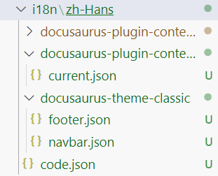

# Docusaurus 翻译功能

关于如何给docusaurus搭建的网页增添翻译功能。

我在查阅官方教程文档时，貌似查到的版本和现在的默认版本差别比较大，所以一直不理解里面的i18n，和怎么创建的i18n翻译的文件夹。随后也翻阅了不少国内的网页，相关资料几乎都少的可怜，最后页只能做到添加翻译按键和翻译一些docusaurus中的基本词语（例如上一页，下一页之类的），但是最重要的首页并不能直接翻译。对我而言是相当困扰，就在我打算放弃时，突然想起去YTB上逛了逛，发现相关的视频教程超级多，跟着其中一个意大利老哥的教程花了二十分钟左右就搞定了。

## 创建网页并且运行
首先请根据官方教程生成个人网页并且运行，这里以classic为例子。
```bash
npm init docusaurus@latest my-website classic
cd my-website
npm run start
```
## i18n配置

在 `docusaurus.config.js` 中增加对 `zh-Hans`（简中）地区的支持:
```js title="docusaurus.config.js"
export default {
  i18n: {
    defaultLocale: 'en',
    locales: ['en', 'zh-Hans'],
  },
};
```
修改 `docusaurus.config.js`中的`themeConfig`，在'items'中添加语言下拉栏组件
```js title="docusaurus.config.js"
{
 type: 'localeDropdown',
   position: 'right',
}
```
## 本地试运行

在终端运行下方指令
```
yarn run start -- --locale zh-Hans
```
最后会弹出本地的访问链接：[http://localhost:3000/zh-Hans/](http://localhost:3000/zh-Hans/)。此时可以发现网页上方右侧已经出现了语言切换栏。但是此时可以看见主页并没有被完全翻译，此时翻看一下博客页，部分内置的一些词语已经被社区翻译成了中文。例如next，read等。

## 翻译API使用

其实只需要这一行指令就能够完成最为关键的一步，就可以翻译全局了。（也是我之前卡住的一步）
```js title="Terminal"
yarn run write-translations -- --locale zh-Hans
```
此时会生成i18n\zh-Hans文件夹,如右图所示


生成的主要文件有四个json文件，打开即可发现有各种网页中出现的词和对应的翻译。你可以修改message后面对应的内容即翻译结果来显示所实际希望的翻译结果。
例如在footer.json中，`link.item.label.Blog`对应的message是博文，修改为文章，再刷新一下，你本地网页上页脚显示的blog就被翻译为了文章。
显而易见，主要的翻译内容集中在code中，也就是js代码中出现的字符串翻译api调用处。

而如何在你自己修改的地方调用翻译api呢？也很简单，只需要在需要翻译的文本上下插入`<Translate>`和`<、Translate>`。如果你不清楚的话，后面有示例可以参考。

## 注意

需要注意的是在/src/compnents/Homepagefeature/index.js中，主页的`<main>`中使用react组件进入了`<section>`.
但是事实上，翻译api是不支持这种类型的，只允许静态文本和字符串的翻译内容。
所以如果你想保留主页的三块文本和图片类似我的主页一样，可以采用像下方一样的格式直接写在reture中。

```js title="index.js"
<Feature
    title={
    <Translate>
    Life is a Good Thing
    </Translate>
   }
    Svg={require('@site/static/img/water.svg').default}
    description={
    <Translate>
    {/* 所需要翻译的文本 */}
    This website is used to record some interesting moments in my life. Regardless of happy or sad, each is unique.
    </Translate>
  }
/>
```
最后的结果类似，但是需要自己添加一下文本的格式，也就是在css中加一下样式，然后在function Feature中指定标题的样式即可。
```js title="index.js"
<Heading as="h2" className={styles.featureTitle}>
  {title}
</Heading>
```
于此，首页的翻译就完成啦！